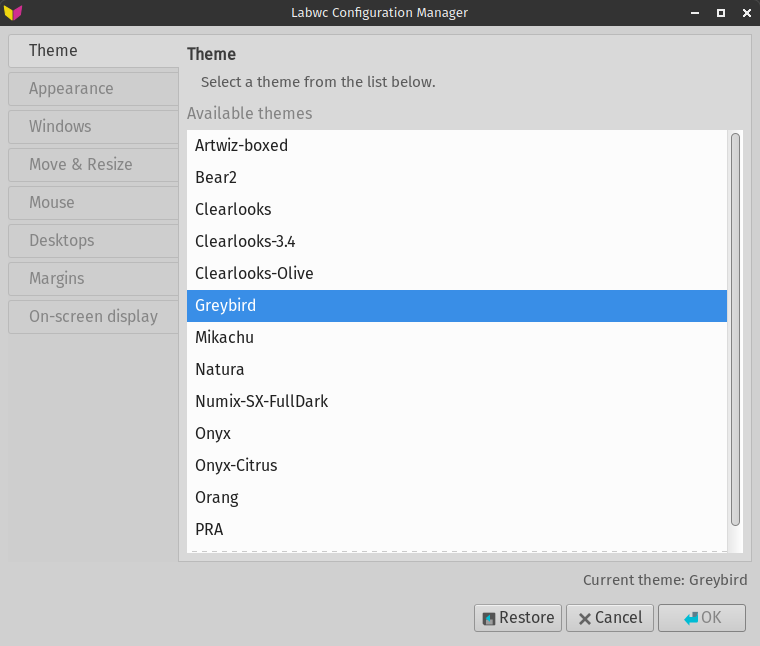
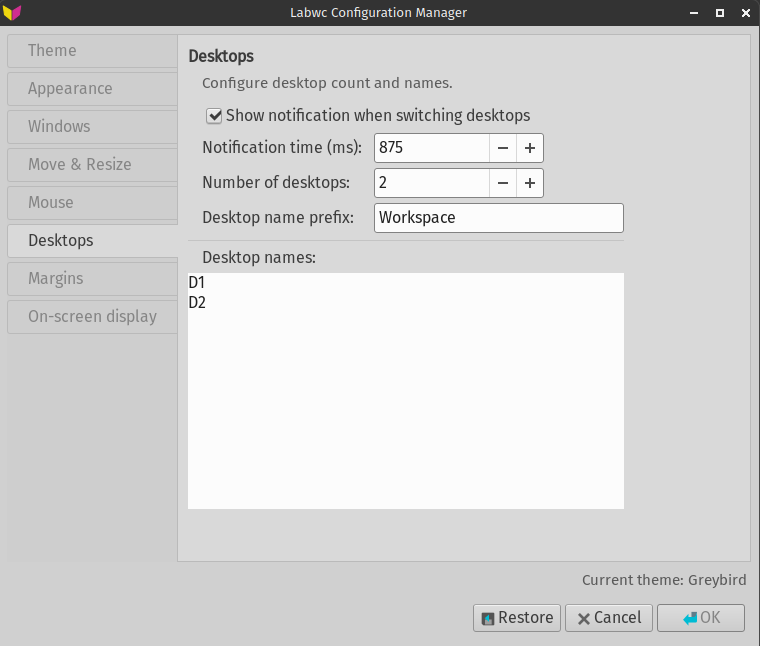

# Labconf

GTK3 application for configuring themes and parameters for labwc (obconf-like for Openbox).

[](https://github.com/sfs-pra/labconf/actions)

## Screenshots




## Features

- Tabs for: Theme, Appearance, Focus, Windows, Mouse, Desktop, Margins, OSD, and Environment variables
- Live-preview changes (`Preview`) with `labwc -r`
- Safe rollback after preview via `Cancel`
- Config compatibility check via CLI: `labconf -t`

## Dependencies

- vala >= 0.56
- gtk3 >= 3.22
- libxml2
- meson
- ninja

## Install dependencies (Arch Linux)

```bash
sudo pacman -S vala gtk3 libxml2 meson ninja
```

## Build and install

```bash
cd /path/to/labconf
meson setup build --prefix=/usr
ninja -C build
sudo ninja -C build install
```

## Run

```bash
labconf
```

Or via application menu: "Labconf"

## Config check

- `labconf -t` — checks current `rc.xml` for labconf compatibility and exits
- `labconf -t -c ~/.config/labwc/rc.xml` — check specific file
- Result format: `PASS` / `WARN` / `FAIL`

## Tests

```bash
tests/run-config-tests.sh
```

## Project structure

```
labconf/
├── meson.build
├── src/
│   ├── main.vala          # Main window, tabs
│   ├── config.vala        # Read/write rc.xml
│   ├── backup.vala        # Backup
│   ├── themes.vala        # Theme scanning
│   └── fonts.vala         # Font scanning
├── data/
│   └── labconf.desktop
├── screenshots/
│   ├── main.png
│   └── settings.png
└── README.md
```

## Config files

- `~/.config/labwc/rc.xml` - main labwc configuration
- `~/.config/gtk-3.0/settings.ini` - GTK3 theme

## Default settings

| Parameter | Value |
|-----------|-------|
| Placement Policy | Cascade |
| Resize Popup | Never |
| WindowSwitcher OSD Style | thumbnail |
| Theme | Greybird |
| Font | DejaVu Sans 10 |

## Notes

- `Cancel` after `Preview` rolls back `rc.xml` and `environment` to original state
- Use `labwc -r` to apply settings

## License

GPL-3.0+

---

[Russian version](README.ru.md)